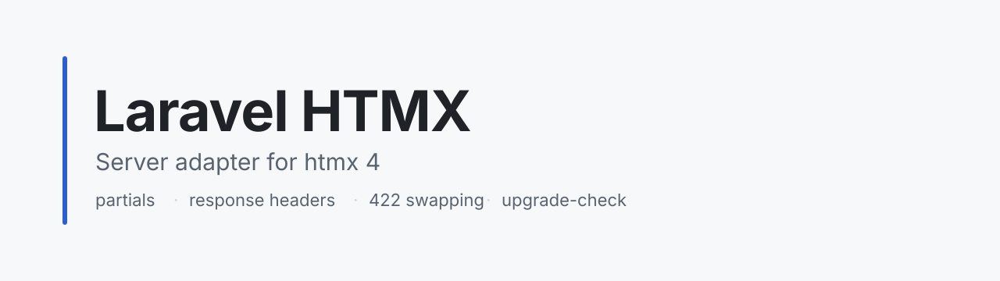

<picture>
    <source media="(prefers-color-scheme: dark)" srcset="art/banner-dark.svg">
    
</picture>

<p align="center">
    <a href="https://packagist.org/packages/imsus/laravel-htmx"></a>
    <a href="https://packagist.org/packages/imsus/laravel-htmx"></a>
    <a href="https://packagist.org/packages/imsus/laravel-htmx"></a>
    <a href="https://github.com/imsus/laravel-htmx/actions"></a>
    <a href="https://packagist.org/packages/imsus/laravel-htmx"></a>
</p>

Build dynamic interfaces with the simplicity of Blade. Laravel HTMX lets your server speak fluent htmx 4 — fragments, swaps, redirects — without reaching for a JavaScript framework.

You're going to love how little changes. Your Blade views stay whole. Your controllers gain one expressive branch. htmx handles the rest.

## Installation

Install the package via Composer:

```bash
composer require imsus/laravel-htmx
```

Then set everything up with a single command. Config, views, and the pinned htmx 4.0.0 client land exactly where Laravel expects them:

```bash
php artisan htmx:install
```

Prefer to publish things yourself? You can publish everything at once:

```bash
php artisan vendor:publish --tag="laravel-htmx"
```

Or piece by piece:

```bash
php artisan vendor:publish --tag="laravel-htmx-config"
php artisan vendor:publish --tag="laravel-htmx-views"
php artisan vendor:publish --tag="laravel-htmx-assets"
```

## Your first fragment

Here is the whole mental model: keep the page and its fragments in one Blade view, then let htmx ask for just the piece it needs.

```blade
{{-- resources/views/items.blade.php --}}
<h1>Items</h1>

@fragment('rows')
<ul id="rows">
    @foreach ($items as $item)
        <li>{{ $item }}</li>
    @endforeach
</ul>
@endfragment
```

```php
use Illuminate\Http\Request;

Route::get('/items', function (Request $request) {
    return view('items', ['items' => Item::all()])
        ->fragmentIf($request->isPartial(), 'rows');
});
```

That's it. htmx requests receive just the `rows` fragment. Everyone else — first visits, boosted navigation, history restores — receives the full page with its layout. You never have to think about which is which; `isPartial()` already knows.

Three spellings, same answer. Pick the one that reads best where you are:

```php
$request->isPartial(); // In controllers — my favorite.
htmx()->isPartial();   // Anywhere via the helper.
Htmx::isPartial();     // Via the facade in services and jobs.
```

## Handling validation beautifully

htmx 4 swaps error responses right into the page, so validation failures feel effortless. Return a `422` with your error fragment, retargeted at a little slot that always lives in the page:

```blade
<div id="form-errors"></div>

@fragment('form-errors')
@foreach ($errors->all() as $error)
<p>{{ $error }}</p>
@endforeach
@endfragment
```

```php
Route::post('/items', function (Request $request) {
    $validator = Validator::make($request->all(), ['name' => 'required|min:3']);

    if ($validator->fails()) {
        return htmx()->errorPartial(
            view('items', ['items' => [], 'errors' => $validator->errors()]),
            'form-errors',
            '#form-errors',
        );
    }

    // ...
});
```

One call renders the `form-errors` fragment on its own, retargets the dedicated `#form-errors` slot with `innerHTML`, and answers `422`. The slot is always present in the page and carries only the messages — and because the swap is `innerHTML` rather than `outerHTML`, the slot survives to see the next submit.

For one-liners, skip the builder and talk straight to the response:

```php
return response($html)->retarget('#rows');
```

Sometimes the default doesn't fit, and that's fine — override per response:

- **Just render it:** return the error partial with `200` when the target handles both success and failure markup itself, like a live region.
- **Move along:** return `200` with `HX-Redirect` or `HX-Location` when the failure leaves the page behind, like an expired session heading to login. Heads up — never use a real `3xx` here; htmx ignores response headers on redirects.
- **Stay loud:** return another `4xx` with the error partial when your client code distinguishes failure kinds.

Curious how it all fits together? Explore `workbench/routes/web.php` — `/` is a runnable fragment, `422`, and history-restore demo, while `/patterns` is a little gallery of active search, delete-in-place toasts, and live validation.

## Including the client

Drop the client into your layout once, and you're done:

```blade
<head>
    <x-htmx::scripts />
</head>
```

This prints versioned scripts with SRI hashes, the strict v4 config meta tag, and your extension allowlist. Sensible defaults ship in `config/laravel-htmx.php` — explicit inheritance off, minimal swap exclusions (`204`, `304`), a 60 second fetch timeout, and server re-fetch history. If you're migrating from 2.x, friendlier legacy values wait as commented opt-ins.

Need a CDN safety net? Flip `assets.cdnFallback` to `true` and the pinned `htmx.org@4.0.0` build steps in when local assets are missing. Extensions live in `assets.extensions` — htmx 4 loads them as direct `<script>` tags, so the package owns the list. The ESM and max builds ship vendored but stay out of your markup until you ask for one:

```blade
@php($esm = app(\Imsus\LaravelHtmx\HtmxAssets::class)->variant('htmx.esm.js'))
<script type="module" src="{{ $esm['src'] }}" integrity="{{ $esm['integrity'] }}" crossorigin="anonymous"></script>
```

Want every popular extension without managing script tags? Flip `assets.core` to `'htmax.js'` — htmx bundled with sse, ws, preload, browser-indicator, download, pending, targets, live, upsert, alpine-compat, and history-cache in one file (~6× the slim core). The scripts component then emits only `htmax.js`, never the standalone extension files alongside it. Note the bundle ships history-cache disabled — opt in when you want it:

```php
'client' => [
    // ...
    'historyCache' => ['disable' => false],
],
```

## Little things you'll appreciate

**Boosted navigation just works.** Add `hx-boost` and links behave like full visits — `isPartial()` returns false, so boosted requests always get the full page. Never a layout-less fragment.

**Events are modern.** Listen for `htmx:*` — the old `htmx:xhr:*` and `htmx:abort` days are gone now that v4 rides on `fetch()`. If your `from:` or `target:` selectors contain spaces or commas, wrap them in single quotes.

**Deletes stay tidy.** Scope a delete to its row's form:

```html
<button hx-delete="/items/1" hx-include="closest form">Delete</button>
```

**Uploads feel normal.** Declare the encoding, target your error slot, and the server reads files like always:

```html
<form hx-post="/avatar" hx-encoding="multipart/form-data" hx-target="#form-errors" hx-swap="innerHTML">
    <input type="file" name="avatar">
    <button type="submit">Upload</button>
</form>
```

```php
$request->file('avatar'); // Just like any other upload.
```

Validation failures return the same `422` error partial into `#form-errors`.

## A few friendly extensions

Five extensions ask a little of your server, so the package speaks their language (the full 17-extension survey lives in `docs/extensions-server-support.md`):

```php
// Skip the swap entirely while the poll tag is current.
return htmx()->poll(view('feed', ['items' => $items]), 'news', $current);

// Read the answer from a pre-request prompt.
$reason = $request->prompt();

// Preloads may never be seen — keep them cheap, never write.
if ($request->isPreloaded()) {
    // Serve something light.
}

// Stream HTML updates over one response (hx-sse).
return htmx()->eventStream([
    '<p>warming up</p>',
    ['data' => '<p>done</p>', 'id' => 'e42'],
]);

// Download a file on the side while the response swaps normally.
return response('<span>Started…</span>')->download('/files/report.pdf');
```

Direct file responses need no helper — `response()->download()` with its `Content-Disposition: attachment` header auto-triggers the extension.

`hx-ptag.js` ships vendored with its SRI hash and allowlist entry, emitted by `<x-htmx::scripts />` alongside the rest.

## Upgrading from htmx 2.x

Let the computer do the boring part. This scans your Blade views — templates included — for everything that changed meaning in v4:

```bash
php artisan htmx:upgrade-check --path=resources/views --ext=.blade.php
```

It flags removed attributes (`hx-ext`, `hx-request`, `hx-vars`, `hx-params`), removed headers (`HX-Trigger-After-Swap`, `HX-Trigger-After-Settle`), XHR-era events, direct extension `<script>` includes, `hx-inherit` (now the `:inherited` modifier), and unquoted `from:(` / `target:(` selectors. It exits non-zero while findings remain, so CI can hold the line.

## Changelog

Please see [CHANGELOG](CHANGELOG.md) for more information on what has changed recently.

## Contributing

Thank you for considering contributing to Laravel HTMX! Please review our [contributing guide](.github/CONTRIBUTING.md) to get started.

## Security Vulnerabilities

Please review [our security policy](.github/SECURITY.md) on how to report security vulnerabilities.

## Credits

- [Imam Susanto](https://github.com/imsus)
- [All Contributors](../../contributors)

## License

Laravel HTMX is open-sourced software licensed under the [MIT license](LICENSE.md).
